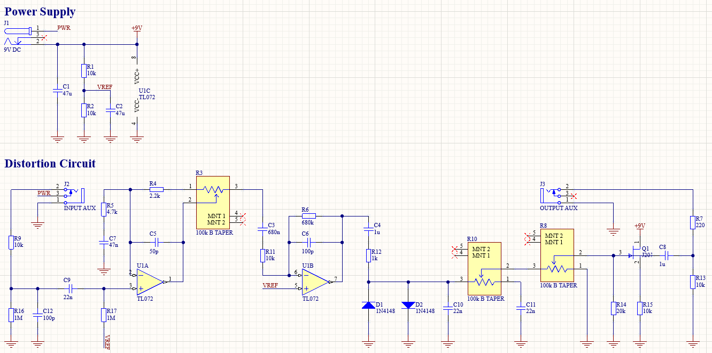
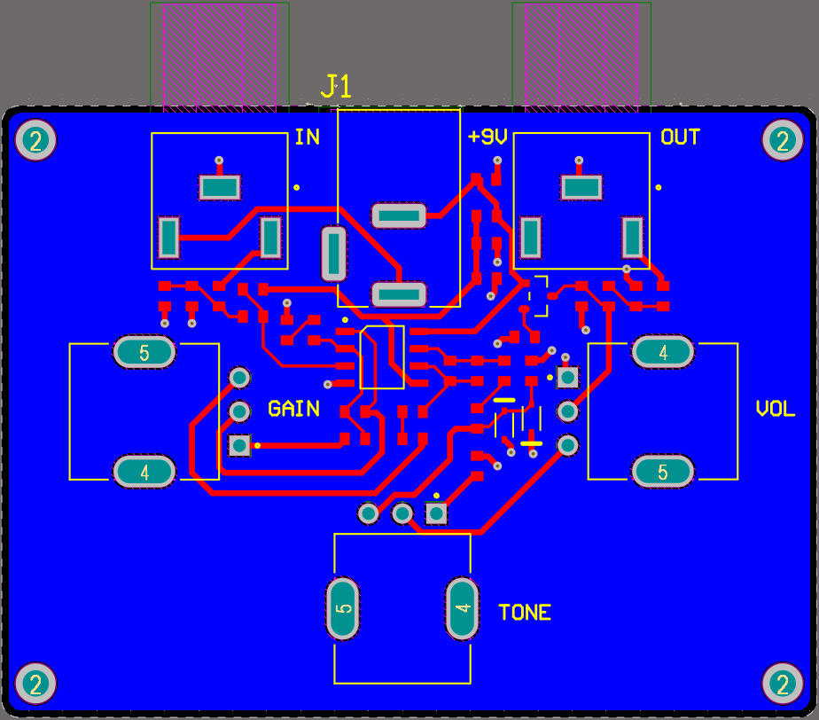
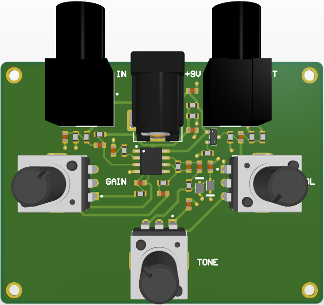

# Guitar Distortion Pedal PCB
I don't even play guitar but this is my first ever PCB project and I need it uploaded before I wipe out my SSD 😰. It's a custom 9 V guitar distortion pedal PCB built around a TL072 dual op-amp on a two-layer SIG-GND stack up, with the circuit design adapted from a [Wampler Pedals tutorial](https://www.wamplerpedals.com/blog/lifestyle-hobby/2024/08/how-to-design-a-basic-distortion-pedal-circuit/). It features the typical three potentiometer knobs to control gain, tone, and volume, I/O audio jacks, and a 9 V DC barrel jack.

## Schematic

## 2D View

## 3D View
